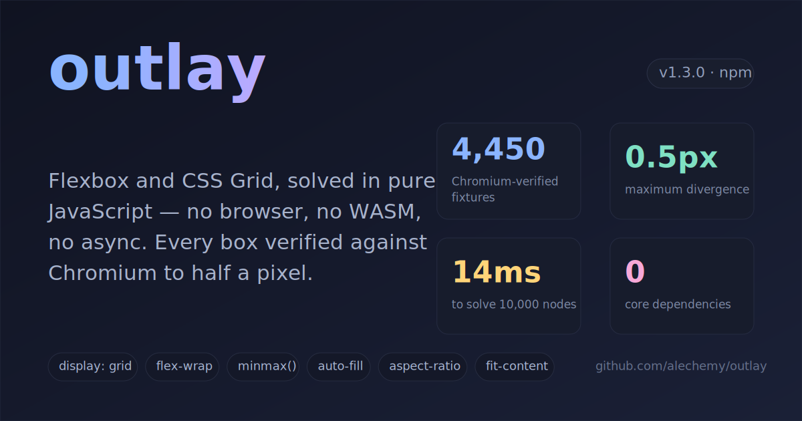

# outlay

outlay computes Flexbox and CSS Grid box positions and sizes off the DOM, in pure synchronous JavaScript with no WASM or native binaries. It matches Chromium at 0.5px tolerance across 4,450 generated fixtures that span the supported CSS subset (see the [compatibility matrix](COMPATIBILITY.md)). It does for CSS layout what [Pretext](https://github.com/chenglou/pretext) does for text measurement: it lifts a DOM-dependent computation out into standalone arithmetic.

That combination of CSS Grid, Chromium fidelity, and pure synchronous JavaScript doesn't exist anywhere else:

| | **outlay** | Yoga (`yoga-layout`) | Taffy (`taffy-layout`) | Satori (HTML → SVG) | Takumi (HTML → image) | jsdom | Headless Chromium / Playwright |
| --- | --- | --- | --- | --- | --- | --- | --- |
| CSS Grid | ✅ | ❌ | ✅ | ❌ | ✅ (Taffy) | ❌ computes no layout | ✅ |
| Flexbox | ✅ | ✅ | ✅ | ✅ (Yoga) | ✅ | ❌ | ✅ |
| Pure JS, no WASM | ✅ | ❌ WASM | ❌ WASM | ❌ Yoga WASM | ❌ Rust (native/WASM) | ✅ | ❌ |
| Synchronous | ✅ | ❌ async init | ❌ async init | ❌ | ❌ async API | ✅ | ❌ |
| Matches browser layout | ✅ 0.5px, fixture-verified | ❌ own model | ❌ own model | ❌ | ❌ own model (Taffy) | ❌ every box is 0×0 | ✅ it *is* the browser |

outlay returns inspectable layout **boxes**, each carrying a position, size, box-model edges, and a baseline. You feed those boxes to whatever consumes them, whether that's an SVG or canvas scene graph, a PDF or report generator, a diagramming or editor surface, or layout assertions in a test. outlay is the layout layer rather than a full image renderer: [Takumi](https://github.com/kane50613/takumi) and [Satori](https://github.com/vercel/satori) handle raster output, image loading, and font shaping, and they reach for a Rust, WASM, or native engine to do it. outlay's contribution is narrow but unique: Chromium-matched Flexbox and CSS Grid as plain synchronous JavaScript, with no engine to instantiate.

Headless rendering is one such use. You solve a Grid, paint the boxes to SVG, and get an OG image or a server-rendered card with no browser in the loop. The card below is a non-uniform `fr` Grid with row and column spans and text wrapped at the `fr`-resolved width, solved and painted headlessly in about 3ms (see the [source](pages/demos/og-image/generate.ts) and [Headless rendering](#headless-rendering) below):



## Installation

```sh
npm install outlay
```

The package ships as ES modules only, with no CommonJS build.

## Quick example

```ts
import { solveLayout } from "outlay";

const root = {
  id: "root",
  width: 400,
  height: 200,
  children: [
    { id: "sidebar", width: 100 },
    { id: "main", flexGrow: 1 },
  ],
};

const { boxes } = solveLayout(root);
boxes.get("sidebar"); // { x: 0, y: 0, width: 100, height: 200, ... }
boxes.get("main"); // { x: 100, y: 0, width: 300, height: 200, ... }
```

Every field is optional. Nodes without an `id` get a collision-safe auto id, and
results are also keyed by the input node objects themselves:

```ts
const sidebar = { width: 100 };
const { nodes } = solveLayout({ width: 400, height: 200, children: [sidebar] });
nodes.get(sidebar); // same ResolvedBox, no ids involved
```

## HTML input

If a layout already exists in your head as markup, `outlay/html` converts an
HTML snippet with inline styles into a `LayoutNode` tree:

```ts
import { parseHTML } from "outlay/html";

const tree = parseHTML(`
  <div style="display: flex; width: 400px; height: 200px; gap: 8px">
    <div id="sidebar" style="width: 100px"></div>
    <div style="flex: 1"></div>
  </div>
`);
const { boxes } = solveLayout(tree);
```

The converter is strict by design: anything it accepts maps 1:1 onto the
supported vocabulary, and anything else (percentages, `em`, `calc()`, classes,
unknown properties, text content) throws an `HTMLParseError` naming the
offending declaration and element. (Text content and paint styles are accepted
by the [`outlay/render`](#headless-rendering) wrapper, which turns the same
markup into a finished SVG.) Two deliberate mappings are worth knowing: elements
without a `display` declaration become outlay's default (`flex`, not CSS's
`block`), and elements without `box-sizing` get an explicit `"content-box"` (the
browser default) so converted trees match what the markup renders. Treat it as a
porting and experimentation tool; for programmatic layout, build `LayoutNode`
trees directly.

## Demos

The demos are live at [alechemy.github.io/outlay](https://alechemy.github.io/outlay/). They include a layout explorer that renders the solver next to real browser CSS with a live match badge, plus animated transitions, drag-and-drop reorder, virtual scrolling, text-driven layout, a nested dashboard with a solver-vs-native toggle, and the headless OG-image generator behind the card above. To run them locally, start `npm start` and open `/demos/index.html`.

## Defaults

| Property     | Default        |
| ------------ | -------------- |
| `display`    | `"flex"`       |
| `boxSizing`  | `"border-box"` |
| `padding`    | `0`            |
| `margin`     | `0`            |
| `border`     | `0`            |
| `children`   | `[]`           |
| `flexGrow`   | `0`            |
| `flexShrink` | `1`            |

`padding`, `margin`, and `border` accept a single number (uniform) or a partial `{ top?, right?, bottom?, left? }` object. Unspecified sides default to zero.

## API

### `solveLayout(root, options?) => { boxes, nodes, contentSize }`

- `root`: `LayoutNode` — the tree to solve
- `options.debug`: `boolean` — when true, returns a `trace` object with intermediate algorithm state (flex phases plus per-container grid track sizes, offsets, and placements)
- Returns:
  - `boxes: Map<string, ResolvedBox>` — keyed by node id
  - `nodes: Map<LayoutNode, ResolvedBox>` — the same boxes keyed by the input node references
  - `contentSize: { width, height }` — the union extent of all border boxes (the scrollable size; e.g. total content height for a virtual scroller)

### `validateTree(root) => ValidationIssue[]`

The solver itself never validates; it assumes a well-formed tree and stays fast. `validateTree` is the development-time companion. Run it in tests or behind a dev flag to catch the mistakes that would otherwise produce a silently wrong layout:

- **errors**: input outside the supported vocabulary — duplicate `id`s (result boxes are keyed by id), percentage or CSS-string sizes (`"50%"`, `"100px"`), unsupported enum values, malformed track lists or grid placements, `NaN` dimensions
- **warnings**: supported input that hits a documented divergence from browser CSS — a `display: "block"` container with no definite height (resolves to content-height 0), vertical margins in block flow (no margin collapse), `baseline` alignment in grid (treated as `start`), `flexBasis: "content"` with a definite main size (treated as `"auto"`, so the size wins), `order` on a grid child (ignored; grid places in document order), fit-content boundary cases (a `fit-content` track inside `repeat()`, or a `fit-content` cross size in a wrap container), an aspect-ratio item that may land in an implicit stretched auto track, plus typo detection for unknown property names (`"flex-direction"` → `flexDirection`)

Each issue carries `{ nodeId, path, severity, message }`, where `path` locates the node (e.g. `root.children[2]`).

```ts
import { solveLayout, validateTree } from "outlay";

if (process.env.NODE_ENV !== "production") {
  const issues = validateTree(tree);
  if (issues.length > 0) throw new Error(issues.map((i) => `${i.path}: ${i.message}`).join("\n"));
}
const { boxes } = solveLayout(tree);
```

### `LayoutNode`

```ts
interface LayoutNode {
  id?: string; // auto-assigned when omitted

  // Box model
  width?: number | "auto" | "min-content" | "max-content" | "fit-content" | `${number}%`;
  height?: number | "auto" | "min-content" | "max-content" | "fit-content" | `${number}%`;
  minWidth?: number | "min-content" | "max-content";
  maxWidth?: number | "min-content" | "max-content";
  minHeight?: number | "min-content" | "max-content";
  maxHeight?: number | "min-content" | "max-content";
  aspectRatio?: number; // width / height, applied to the box-sizing box
  padding?: number | Partial<BoxSides>;
  margin?: number | Partial<MarginBoxSides>; // supports "auto" per-side
  border?: number | Partial<BoxSides>;
  boxSizing?: "content-box" | "border-box";

  // Flex container
  display?: "flex" | "grid" | "block" | "none";
  flexDirection?: "row" | "column" | "row-reverse" | "column-reverse";
  flexWrap?: "nowrap" | "wrap" | "wrap-reverse";
  justifyContent?:
    | "flex-start"
    | "flex-end"
    | "center"
    | "space-between"
    | "space-around"
    | "space-evenly";
  alignItems?: "flex-start" | "flex-end" | "center" | "stretch" | "baseline";
  alignContent?:
    | "flex-start"
    | "flex-end"
    | "center"
    | "stretch"
    | "space-between"
    | "space-around"
    | "space-evenly";
  gap?: number | { row: number; column: number };

  // Flex item
  flexGrow?: number;
  flexShrink?: number;
  flexBasis?: number | "auto" | "content" | `${number}%`;
  alignSelf?:
    | "auto"
    | "flex-start"
    | "flex-end"
    | "center"
    | "stretch"
    | "baseline";
  order?: number;

  // Positioning
  position?: "static" | "relative" | "absolute" | "fixed";
  top?: number;
  right?: number;
  bottom?: number;
  left?: number;

  // Content
  children?: LayoutNode[];
  measureContent?: (availableWidth: number) => {
    width: number;
    height: number;
  };
}
```

### `ResolvedBox`

```ts
interface ResolvedBox {
  id: string;
  parentId?: string; // input-tree parent (undefined for the root)
  x: number; // border-box position relative to root's content-box origin
  y: number;
  width: number; // content-box dimensions
  height: number;
  padding: BoxSides;
  border: BoxSides;
  margin: BoxSides; // includes resolved "auto" margins
  borderBoxWidth: number;
  borderBoxHeight: number;
  outerWidth: number; // borderBoxWidth + margin left + right
  outerHeight: number;
  baseline?: number; // border-box top to first baseline
}
```

### `measureContent` callback

This callback is for leaf nodes whose content size is determined externally, such as text. The solver calls it with the available content width, and it returns the intrinsic `{ width, height }` of the content at that width. The solver probes it at `0` (min-content) and `Infinity` (max-content) as well as at resolved widths, so **return the real content width, not the available width**; grid track sizing and `min-width: auto` floors depend on it.

See [Text](#text) for the Pretext adapter.

## Text

The engine does no line breaking itself. A text leaf is a node with a `measureContent` callback that reports the wrapped `{ width, height }` for a given available width. The solver measures each text item at its resolved width (the flex main size, or the grid column width once tracks resolve), so wrapped heights drive flex cross sizes and grid auto rows, and the widest word (`measureContent(0).width`) floors `min-width: auto` and intrinsic tracks.

Any measurer that honors that contract works, and two ship with the package:

**In a browser or worker**, `outlay/pretext` wraps [Pretext](https://github.com/chenglou/pretext), an optional peer dependency you install with `npm install @chenglou/pretext`:

```ts
import { text } from "outlay/pretext";

const label = text("The quick brown fox", { font: "16px Arial", lineHeight: 20 });
// → a LayoutNode leaf; spread extra props: text("…", { font, lineHeight, flexGrow: 1 })
```

`text()` runs Pretext's one-time canvas measurement pass, so it needs an `OffscreenCanvas` or DOM canvas and throws in bare Node.

**In Node** (tests, servers), `outlay/text` provides the same greedy line breaker the fixture suite verifies against Chromium, driven by precomputed per-word advances:

```ts
import { measureFromWordWidths, textNode } from "outlay/text";

const measure = measureFromWordWidths("The quick brown fox", wordMetricsTable);
const label = textNode(measure, { id: "label" });
```

Capture the advances once (in a browser, or from font metrics) and commit them; `measureFromAdvances` takes a raw `number[]` if you manage words yourself.

**From a font file**, `outlay/font` parses TTF/OTF metrics directly, so no browser is needed even for the capture step:

```ts
import { readFileSync } from "node:fs";
import { parseFont, measureText } from "outlay/font";
import { textNode } from "outlay/text";

const inter = parseFont(readFileSync("Inter-Regular.ttf"));
const label = textNode(
  measureText(inter, "The quick brown fox", { size: 16, lineHeight: 20 }),
);
```

The font parser has no dependencies of its own; it reads the `head`, `cmap`, `hhea`, and `hmtx` tables straight out of a `DataView`. Advances are unshaped and unkerned: they are the per-glyph sums Chromium produces with `font-kerning: none` and ligatures disabled, verified against Chromium to 0.015px. With default shaping the browser comes out narrower on kerned pairs such as `AV` and `To`, so use captured advances or Pretext when that matters.

Things to keep in mind:
- **Match the CSS wrapping mode.** Pretext models `overflow-wrap: break-word` (it breaks inside long words at narrow widths), so render the same text with `overflow-wrap: anywhere` for the browser to agree at widths narrower than a word. With `overflow-wrap: normal` the min-content is the widest word instead.
- **Quantize like the engine for exact agreement.** Chromium stores accumulated line widths and intrinsic text widths as LayoutUnit (1/64px, floored), so at knife-edge widths a word fits where raw float accumulation says it doesn't. Both shipped measurers apply this quantization; if you write your own, floor the running line width to 1/64 before each fit comparison and floor the widths you return. The solver itself stays quantization-free; the contract lives entirely in the `measureContent` implementation.

The `pages/demos/text-layout.html` demo wires this adapter into a live card grid and checks the solver against the browser at 0.5px tolerance.

## Headless rendering

Solving positions is only half the job; `outlay/svg` paints them. `renderToSvg`
takes a solved tree and a per-node style callback (fills, strokes, rounded
corners, and line-broken text) and returns an SVG string:

```ts
import { solveLayout } from "outlay";
import { renderToSvg } from "outlay/svg";

const result = solveLayout(tree);
const svg = renderToSvg(tree, result, {
  style: (node) => styles.get(node.id), // { fill?, stroke?, radius?, text? }
});
```

Text paints through the same numbers it was measured with: `breakLines` (from
`outlay/text`) shares its quantized fit test with `measureFromAdvances`, so the
painted lines are exactly the lines the solver sized, and each line carries
`textLength`, so any SVG viewer reproduces the measured widths even when it
substitutes a fallback font.

The card at the top of this README is this pipeline end to end.
[`pages/demos/og-image/generate.ts`](pages/demos/og-image/generate.ts) builds a
grid tree, measures its text from a committed Inter TTF via `outlay/font`,
solves, and paints, all in about 3ms with no browser in the loop. That layout,
non-uniform `fr` columns with spans and wrapped text driving track sizes, is the
part Satori and Yoga can't express.

For debugging or documenting a layout, `renderDebugSvg` draws every resolved
box with depth colors, ids, and sizes, plus dashed grid-track outlines when
given a debug trace:

```ts
import { renderDebugSvg } from "outlay/svg";

const result = solveLayout(tree, { debug: true });
fs.writeFileSync("layout.svg", renderDebugSvg(tree, result, { trace: result.trace }));
```

When the layout already exists as markup, `outlay/render` composes the whole
pipeline in one call, in the shape of Satori but Grid-capable:

```ts
import { readFileSync } from "node:fs";
import { htmlToSvg } from "outlay/render";

const svg = htmlToSvg(
  `<div style="display: grid; width: 800px; grid-template-columns: 1fr 1fr; gap: 16px;
               padding: 24px; background: #101321; border-radius: 16px;
               font-family: Inter; font-size: 15px; line-height: 22px; color: #e6e9f2">
     <div style="grid-column: 1 / span 2; font-size: 28px; line-height: 34px; font-weight: 700">Weekly report</div>
     <div style="background: #171c2c; border-radius: 10px; padding: 16px">Signups grew 14% week over week.</div>
     <div style="background: #171c2c; border-radius: 10px; padding: 16px">Median solve time held at 1.7ms.</div>
   </div>`,
  { fonts: { Inter: readFileSync("Inter-Regular.ttf") } },
);
```

Text properties (`font-family`, `font-size`, `font-weight`, `line-height`,
`color`, `text-align`) inherit down the tree like CSS, and the paint vocabulary
is solid backgrounds, `border-radius`, and `border-color`. Everything else keeps
`parseHTML`'s strictness, so unsupported CSS throws with the element's path, and
`htmlToLayout` returns the intermediate `{ tree, styles }` when you want to solve
or inspect before painting.

SVG is the supported output. Rasterizing to PNG (for OG images proper) takes any
SVG rasterizer, whether `sharp`, `resvg`, or a browser screenshot; outlay
deliberately stops at the vector.

## Testing layouts

Because `solveLayout` is synchronous and browser-free, you can assert a component's
layout (overlaps, overflow, breakpoint column counts) inside a plain unit test, and
sweep hundreds of viewport widths in a few milliseconds. The `outlay/testing` subpath
ships the primitives:

```ts
import { sweep, assertNoOverlaps, overflowsX } from "outlay/testing";

const widths = Array.from({ length: 49 }, (_, i) => 320 + i * 20); // 320…1280
const failures = sweep(widths, buildCardGrid, (result) => {
  assertNoOverlaps(result, cardIds);
  if (overflowsX(result, "page")) throw new Error("content crosses the page edge");
});
expect(failures).toEqual([]); // each failure names the width that broke
```

`sweep(widths, buildTree, invariant)` solves `buildTree(width)` at every width and
collects the widths where `invariant` throws. `assertNoOverlaps(result, ids?)` throws on
the first overlapping pair (siblings only when `ids` is omitted); `overflowsX` /
`overflowsY` report whether any descendant escapes a container's border box.

jsdom computes no layout, WASM engines need async init, and Playwright is heavy for a
question as small as "does this overflow at 375px", so a synchronous solver fits. The
full worked example, with those primitives plus a Node-safe text measurer, a responsive
card grid, and a regression guard, is in
[`examples/layout-assertions/`](examples/layout-assertions/); run it with
`npm run test:example`.

## What's supported

The [compatibility matrix](COMPATIBILITY.md) states this precisely, sorting each behavior into verified, supported but unverified, an intentional divergence, or a non-goal. In brief:

- Flexbox layout (row, column, reverse, wrap)
- `flex-grow`, `flex-shrink`, `flex-basis` with iterative clamping
- Percentage `width` / `height` / `flexBasis` on flex children, resolved against the containing block's content box — including parents sized by the solver itself (flex-grown, stretched, or auto-main containers, where percentages re-resolve once the main size is determined)
- `justify-content`: all 6 values
- `align-items` / `align-self` (including `baseline`) / `align-content` (all 7 values)
- `gap` (single value and `{ row, column }`, including wrapped lines)
- `min-width` / `max-width` / `min-height` / `max-height` on both axes, including `min-content` / `max-content` keywords (keyword heights assume width-independent content — see coverage boundaries)
- Multi-line wrapping (`wrap`, `wrap-reverse`)
- Nested flex containers with indefinite size resolution
- `min-content` / `max-content` / `fit-content` intrinsic sizing on container widths/heights and on flex items
- `aspectRatio` on flex and grid items (transferred sizes, transferred automatic minimums, stretch precedence)
- Width-dependent content via `measureContent` (e.g. text): items are measured at their resolved main size, so wrapped heights drive cross sizes, and the widest word floors `min-width: auto` and feeds line breaking (see [Text](#text))
- `display: block` containers with children, nested anywhere in a flex tree
- `position: absolute` and `position: fixed`
- `margin: auto` centering (both axes)
- `display: none`
- `order` property (flex)
- `content-box` and `border-box` sizing

There is no `overflow` property, because outlay never paints or scrolls. The one layout-relevant effect of `overflow: hidden` in CSS, releasing a flex item's automatic minimum size so it can shrink past its content, is expressed with `minWidth: 0` / `minHeight: 0` on the shrinking child, exactly as in CSS flexbox practice.

CSS Grid (`display: "grid"`):

- Track sizing: fixed px, `fr` (content-based minimums), `auto`, `minmax()`, `min-content` / `max-content`, `fit-content(limit)` (as `{ fitContent: px }`), `repeat` (fixed-count, `auto-fill`, and `auto-fit` with empty-track collapse)
- Placement: explicit lines (positive and negative), `span n`, sparse auto-placement (`row` and `column` flow), `dense` packing
- Implicit tracks via `gridAutoRows` / `gridAutoColumns`
- `gap` (single value and `{ row, column }`)
- Alignment: `justifyItems` / `justifySelf`, `alignItems` / `alignSelf` (flex vocabulary; `flex-start`/`flex-end` behave as `start`/`end`), `justifyContent` / `alignContent` distribution, auto margins
- Grid and flex compose: grid inside flex, flex inside grid, nested grids, including intrinsic sizing of nested grids
- Text in grid cells: auto rows sized by wrapped text at the resolved column width; text `measureContent` feeds min-content (widest word) and max-content (single line) track contributions

Grid exclusions for v1 are percentage tracks (the caller resolves them), named lines and `grid-template-areas` (the caller resolves them to line numbers), subgrid, masonry, and grid baseline alignment.

A few behaviors are accepted but sit outside the verified fixture set, so treat them with care: aspect-ratio items in implicit stretched auto tracks, `fit-content` tracks inside `repeat()`, `fit-content` cross sizes in a wrap container, and aspect-ratio combined with auto margins. `validateTree` flags the ones it can detect statically.

## Non-goals

- No CSS parsing, cascade, or selector matching — the caller provides resolved values
- No raster output — the core solver produces boxes; `outlay/svg` is a thin optional painter over the result, and PNG/PDF is the caller's rasterizer
- No rich inline layout (bidi, shaping, mixed inline formatting) — word-level greedy breaking ships in `outlay/text` / `outlay/font`; use Pretext for browser-grade measurement
- No floats, no table layout
- No right-to-left direction or writing modes — layout is left-to-right, `horizontal-tb`
- No block-flow margin collapsing, and no auto-height for `display: block` containers (give block containers a definite height)

## Accuracy

4,450 fixtures across 35 tiers pass, all measured against Chromium `getBoundingClientRect()` ground truth at a tolerance of 0.5px per property per node. That claim is scoped to the **supported CSS subset**, the vocabulary the generator emits, not to browser CSS as a whole. The [compatibility matrix](COMPATIBILITY.md) lays out what's verified, what's supported but unverified, where outlay intentionally diverges from browser CSS, and what's a deliberate non-goal.

## Performance

| Tree size    | Depth    | Time    |
| ------------ | -------- | ------- |
| 100 nodes    | 2 levels | ~0.06ms |
| 1,000 nodes  | 3 levels | ~1.1ms  |
| 10,000 nodes | 5 levels | ~14ms   |

Measured on Apple Silicon. Run `npm run bench` to reproduce.

Every `solveLayout` call solves the whole tree from scratch; there is no incremental relayout or dirty-marking, so interactive callers at very large node counts should throttle solves or solve only the affected subtree.

## License

MIT
